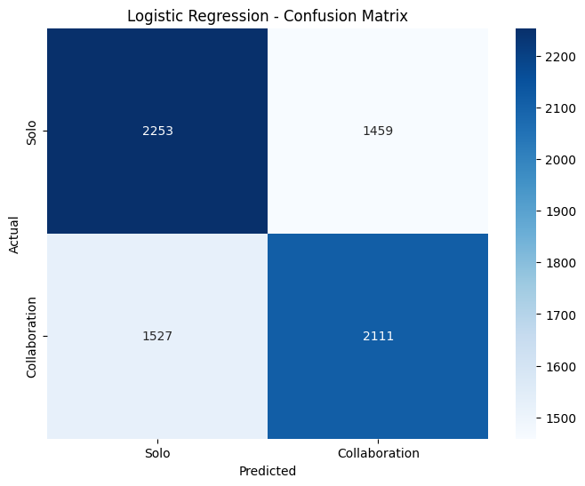

# Spotify Machine Learning Case Study 🎧

**Author:** Sama Borhani  
**Date:** July 2025  

---

## 1. Introduction

This project applies machine learning to **Spotify track-level audio data** to explore two questions:

1. Do hit songs increase the popularity of other tracks on the same album?  
2. Can we predict whether a track is a **collaboration** using its audio features?  

The analysis demonstrates a complete ML pipeline: **data cleaning → feature engineering → exploratory analysis → modeling → evaluation**.

---

## 2. Dataset

- **Source:** [Spotify Tracks Dataset (Hugging Face)](https://huggingface.co/datasets/maharshipandya/spotify-tracks-dataset)  
- **Size:** ~114,000 tracks × 21 features  
- **Features:**  
  - Audio: `danceability`, `energy`, `loudness`, `speechiness`, `acousticness`, `instrumentalness`, `liveness`, `valence`, `tempo`  
  - Metadata: `artists`, `album_name`, `track_name`, `explicit`, `key`, `mode`, `time_signature`, `track_genre`  
- **Engineered Features:**  
  - `duration_mins` (converted from `duration_ms`)  
  - `collaboration` flag (True if multiple artists listed)  

The final dataset used for modeling had ~72,800 cleaned tracks after filtering and feature engineering.

---

## 3. Methodology

### Data Cleaning & Feature Engineering
- Dropped duplicates and missing values.  
- Converted durations from milliseconds to minutes.  
- Flagged collaborations based on multiple artists.  
- Filtered out spoken-word tracks with very high `speechiness`.

### Exploratory Analysis
Outliers and distributional properties of the features were examined:  

- **Boxplots** showed strong outliers in features like `loudness` and `tempo`.  
- **Q-Q plots** confirmed that many audio features deviate from normality.  

  
*Figure 1. Boxplots showing outliers in audio features.*  

  
*Figure 2. Q-Q plots showing non-normal distributions for key features.*  

---

## 4. Results

### 4.1 Do hit songs lift albums?
Linear regression was used to test whether hit tracks boost the popularity of other tracks on the same album.  

- Result: **Weak relationship (R² ≈ 0.01)** → little evidence that hits increase the popularity of their album peers.  

  
*Figure 3. Relationship between hit and non-hit tracks within albums.*  

---

### 4.2 Predicting Collaborations

#### Logistic Regression
- Balanced dataset via undersampling.  
- Achieved **AUC ≈ 0.63, Accuracy ≈ 0.59**.  
- Some predictive power, but limited compared to non-linear methods.  

  
*Figure 4. Confusion matrix for Logistic Regression collaboration prediction.*  

#### Random Forest
- Stronger classifier: **AUC ≈ 0.90, Accuracy ≈ 0.86**.  
- Top predictive features: `danceability`, `acousticness`, `loudness`, `speechiness`, `tempo`, `valence`.  

  
*Figure 5. Feature importance for Random Forest model.*  

  
*Figure 6. ROC curves comparing Logistic Regression and Random Forest.*  

---

## 5. Discussion

- **Album hit lift effect:** essentially absent, with regression showing near-zero explanatory power.  
- **Logistic regression:** interpretable but underpowered for complex relationships in music data.  
- **Random forest:** provided strong predictive ability and meaningful feature insights.  

Key takeaway: **non-linear models outperform linear baselines in predicting collaborations** using Spotify audio features.

---

## 6. Conclusion

This case study demonstrated how machine learning can be applied to Spotify audio features:  

- Data cleaning and feature engineering prepared the dataset for analysis.  
- Exploratory analysis revealed heavy-tailed distributions and outliers.  
- Regression showed that hit tracks don’t significantly boost album peers.  
- Classification highlighted that **Random Forests achieve excellent predictive power (AUC ~0.90)** for collaboration detection.  

This project provided hands-on experience with an **end-to-end ML workflow** in the music domain and highlights the importance of using the right model for the task.

---
